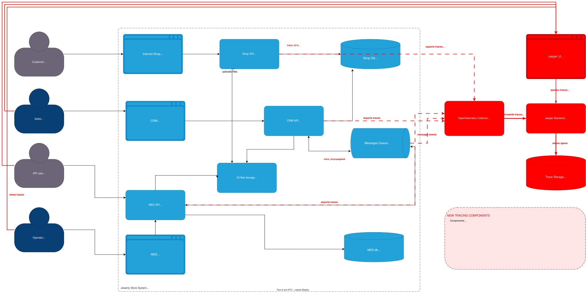

# Мотивация

- Заказы зависают в непонятном состоянии
- Невозможно понять, где именно застрял заказ

# Предлагаемое решение

- OpenTelemetry Collector для получения трейсов от сервисов и дальнейшей отправки в Jaeger backend
- Jaeger Backend + Elasticsearch для хранения и индексирования трейсов
- Jaeger UI

# Компромиссы

- Performance overhead - каждый span добавляет 0.1-1ms latency
- трейсы могут содержать чувствительные данные клиентов
- Отсутствие экспертизы - команде нужно обучение 
- Нестабильная архитектура - при активном рефакторинге трейсинг придется постоянно переписывать

# Безопасность
- Аутентификация через SSO - только сотрудники с корпоративными учетными записями
- RBAC 3 роли - Admin, Support (read-only), Developer (только свои сервисы)
- автоматическое удаление/маскирование email, телефонов, токенов
- полная история доступа к трейсам
- автоудаление через 30 дней
- Шифрование - encryption-at-rest (AES-256) + TLS 1.3
