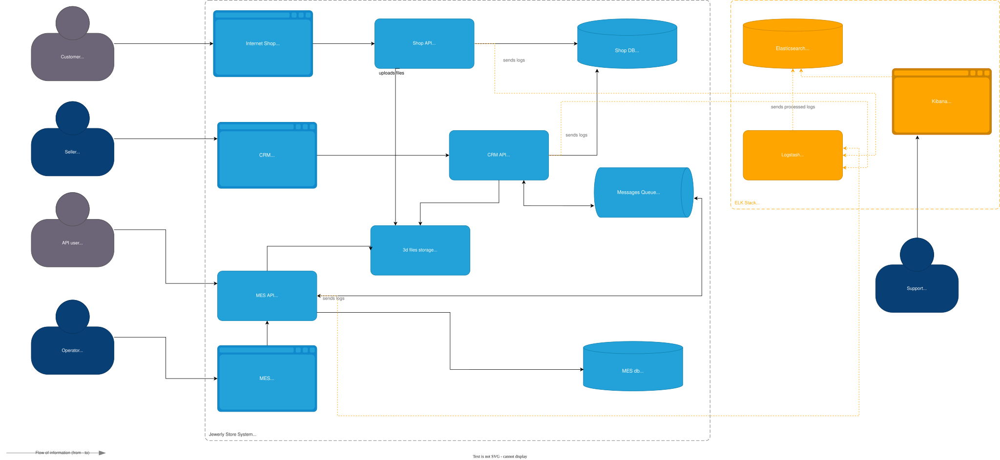

# Анализ

## INFO (основной уровень для production):
**Когда использовать:**
- Нормальные операции системы
- Бизнес-события (создание заказа, смена статуса)
- Успешные операции
- Performance метрики

**Примеры:**
- shop-api HTTP Request/Response Logs
- shop-api Создание заказа
- shop-api Загрузка 3D файла
- shop-api Подтверждение заказа
- shop-api Логирование Database slow queries
- shop-api File uploaded to S3 successfully
- shop-api User logged in successfully
- shop-api Payment processed successfully
- mes-api Подтверждение, что MES получил заказ. Если нет - ищем проблему в RabbitMQ
- mes-api Подтверждение, что сообщение попало в RabbitMQ. Без этого заказ потерян
- mes-api Завершение расчета цены
- mes-api Изменение статуса заказа
- crm-api Одобрение производства

## WARN
**Когда использовать:** Проблемы, которые не блокируют работу, но требуют внимания

**Примеры:**
- Retry операция e.g. s3.upload_retry
- Медленная операция: Price calculation taking longer than expected
- Приближение к лимитам: Database connection pool usage high
- RabbitMQ очередь растет: Queue depth increasing

## ERROR
**Когда использовать:** Ошибки, которые блокируют операцию

**Примеры:**

- Ошибка загрузки файла
- Ошибка расчета цены
- Database ошибка
- RabbitMQ publish failed

# Мотивация

**Проблемы:**
-  Логи разбросаны по серверам
-  Нет единого формата логов (каждое приложение пишет по-своему)
-  Нет корреляции между событиями в разных системах
-  Нет поиска по логам (только grep)

**Выгоды:**
-  Все логи в одном месте
-  Единый формат (structured JSON)
-  Корреляция по order_id, trace_id, customer_id
-  Быстрый поиск (индексы Elasticsearch)
-  Support может самостоятельно диагностировать проблемы
-  Дашборды и алерты на основе логов

Логирование поможет уменьшить время обнаружения проблемы и время устранения проблемы, сэкономит ресурcы поддержки и devops.

**Очередность:**

- MES API (самый проблемный)
- Shop API (точка входа)
- RabbitMQ (пропадают запросы)
- CRM API
- PostgreSQL slow queries
- S3, Frontend

# Предлагаемое решение

Сбор логов с помощью стека ELK стэка - Elastic для хранения и поиска, Logstash для сбора и обработки, Kibana для отображения и поиска.

 

## Безопасность
- Доступ к логам осуществляется через Kibana. Роли:
    - DevOps, архитектор - доступ к логам и настройкам логирования
    - Support, доступ на чтение логов на prod
    - Разработчики, QA - доступ на чтение логов на dev
- Аудит входов, запросов в Кибане
- Персональные данные должны быть токенезированы, либо исключены. Пароли исключены
- Логи между сервисами передаются с с использоавнием шифрования  TLS 1.3

## Хранение
- Использовать отдельные индексы по дням для каждого микросервиса (daily indices). Такой подход упрощает ротацию и удаление старых данных.
- Длительность хранения 30 дней с дальнейшим перерходом на «холодное» хранение, чтобы снизить нагрузку и стоимость.
- Хранение особо важных логов. Например, slow queries, ошибки или платежные операции можно сохранять дольше или в отдельные индексы для удобного анализа и аудита.

## Анализ логов

Настроить оповещения в случае:
- Ошибок и исключений: Логи с уровнем error, fatal, exceptions
- Снижении производительности: медленные запросы к базе, тайм-ауты, ошибки в RabbitMQ и т.п.
- Неожиданного поведение системы: резкий рост количества ошибок, отказов API.
- Резких скачков или падений числа созданных заказов, успешных платежей.